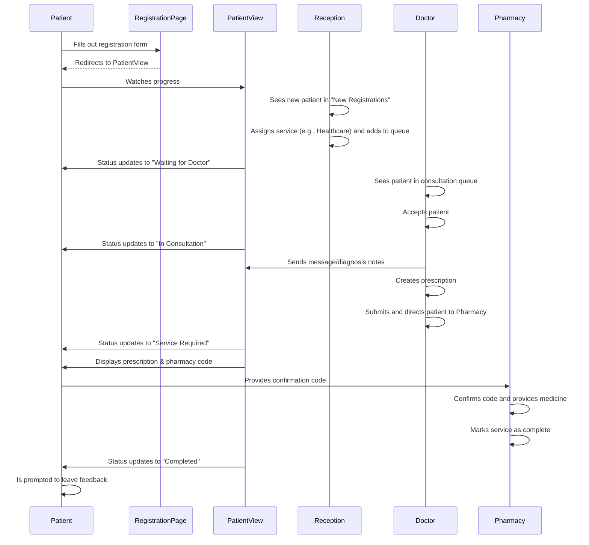

# MediQueue: A Streamlined Patient Management System

MediQueue is a web application prototype designed to streamline patient registration, queue management, and service delivery in a charity healthcare setting. It provides distinct interfaces for patients, receptionists, doctors, dentists, service room staff, and supervisors to manage the patient journey efficiently.

## Core Features

-   **Patient Registration**: A simple, multilingual form for patients to register using their name, phone number, and nationality.
-   **Patient View**: A real-time status page for patients to track their progress through the clinic's workflow, from registration to completion.
-   **Reception Dashboard**: An interface for receptionists to view newly registered patients, assign them to a service (like Healthcare or Dentistry), and add them to the active queue. It also allows for manual patient registration.
-   **Doctor/Dentist Consoles**: Specialized dashboards where doctors and dentists can see their queue, accept patients, record diagnoses, and create structured prescriptions. Includes AI-powered features for drug availability checks and text translation.
-   **Service Rooms (Pharmacy, Lab, Nursing)**: Simple interfaces for service personnel to manage their queues and process patients using a confirmation code system.
-   **Supervisor Dashboard**: A high-level view for a supervisor to monitor all patient journeys, manage doctor availability, re-assign doctors, flag emergency cases, and add special notes to patient records.
-   **Patient Feedback**: A simple, star-based rating and comment form for patients to provide feedback after their visit is complete.

## Technical Stack

-   **Framework**: Next.js (with App Router)
-   **Language**: TypeScript
-   **UI**: React, ShadCN UI Components
-   **Styling**: Tailwind CSS
-   **AI**: Google Genkit (simulated/mocked for this demo)

## Patient Flow Sequence Diagram

This diagram illustrates the typical journey of a patient through the MediQueue system.

## Prompts for Building from Scratch

The following are detailed prompts that could be given to an AI code generation tool to build the MediQueue application using different technology stacks.

---

### Prompt for Next.js and Genkit

**Prompt:**

Build a Next.js application called "MediQueue" for managing patient flow in a charity clinic. Use TypeScript, ShadCN UI components, and Tailwind CSS. The app should have several user roles and corresponding pages: Patient Registration, Patient View, Reception, Doctor, Dentist, Pharmacy, Lab, Nursing, and Supervisor.

**1. Style and Layout:**
-   **Colors**: Use a calming color scheme. Primary: Light sky blue (`#87CEEB`), Background: Very light blue (`#F0F8FF`), Accent: Soft teal (`#77D8D8`).
-   **Font**: Use 'PT Sans'.
-   **Layout**: Create a main layout with a persistent sidebar for navigation between the different role pages. The patient-facing pages (Registration, Patient View, Feedback) should be publicly accessible, while the staff pages should feel like they are behind a login.

**2. Pages and Features:**

-   **Patient Registration (`/`)**: A form with fields for "Full Name", "Phone Number", and "Nationality" (dropdown with flags for Iranian, Iraqi, Turkish, Pakistani, English). On submission, it should redirect to the Patient View page.
-   **Patient View (`/patient/[id]`)**:
    -   Displays the patient's journey as a series of steps (e.g., Registered, Waiting for Doctor, In Consultation, Service Required, Completed). The current step should be visually highlighted.
    -   This page should be translated based on the patient's selected nationality.
    -   Allow the patient to send a simple text message to the doctor.
    -   After the doctor's visit, display the final prescription in a table format. The patient should be able to translate the prescription into their language.
    -   When the visit is complete, show a button to navigate to the Feedback page.
-   **Reception Page (`/reception`)**:
    -   Two sections: "New Registrations" and "Active Queue".
    -   Receptionist can select a service (Healthcare, Dentistry) for new patients and add them to the Active Queue.
    -   Include a "Manual Registration" button that opens a dialog to add a patient manually.
-   **Doctor & Dentist Pages (`/doctor`, `/dentist`)**:
    -   Show a list of waiting patients. The user can "Accept" a patient.
    -   When a patient is accepted, display their details and any message they sent.
    -   Provide a button to translate the patient's message.
    -   Include a prescription form as a table where multiple drugs/services can be added with "Drug", "Dosage", and "Notes" fields.
    -   Check for unavailable drugs (e.g., "Ibuprofen", "Amoxicillin") and show a warning.
    -   After filling out the prescription, the doctor can select the next service (e.g., Pharmacy, Lab, Nursing) and submit, which removes the patient from their queue.
-   **Service Pages (`/service/pharmacy`, `/service/lab`, `/service/nursing`)**:
    -   These pages should have an input for a confirmation code.
    -   When a valid code is entered, it displays the patient's name and the required service details.
    -   The staff can then mark the service as complete.
    -   The Pharmacy page should also have a "Manual Delivery" dialog for special cases.
-   **Supervisor Page (`/chairman`)**:
    -   Display a table of all patients with their current step, assigned doctor, and any issues.
    -   Allow the supervisor to re-assign a doctor to a patient from a dropdown of available doctors.
    -   Allow the supervisor to manage doctor availability (Available, Busy, Away).
    -   Include a button to toggle an "Emergency" status for a patient, which should highlight their row in the table.
    -   Allow the supervisor to edit a patient's journey and add special notes to their prescription.
-   **Feedback Page (`/feedback/[id]`)**: A simple form with a 5-star rating component and a comments text area.

**3. AI and Logic (Simulated):**
-   Use Genkit to structure the AI flows.
-   **Translation**: Create a `translateText` flow. For the prototype, this can be a mock that returns the original text prefixed with the target language (e.g., `[Turkish] Paracetamol`).
-   **Prescription Check**: Create a `checkPrescription` flow that checks a drug name against a hardcoded list of unavailable drugs and returns advice if a match is found.

All data should be hardcoded in the component state for this prototype. Ensure a seamless and interactive experience.

---

### Prompt for Refine, MUI, and Vite

**Prompt:**

You are an expert in the Refine framework. Build a Vite-powered application called "MediQueue" using Refine with the Material UI (MUI) component library. This application is for managing patient flow in a charity clinic. All data for this prototype should be managed by a mock data provider (e.g., `@pankod/refine-simple-rest`) with hardcoded initial data.

**1. Resources and Data Model:**
-   Define the primary resource as `patients`. A patient object should include: `id`, `name`, `phone`, `nationality`, `status` (e.g., 'registered', 'waiting-doctor', 'in-consultation'), `assignedService`, `assignedDoctorId`, `message`, `prescription`, and `notes`.
-   Define a `doctors` resource: `id`, `name`, `status` ('available', 'busy', 'away').

**2. Authentication and Roles:**
-   Set up a mock `authProvider` to simulate different user roles: `patient`, `reception`, `doctor`, `dentist`, `supervisor`. The login page can be a simple form that lets you select a role to "log in" as.
-   Use role-based access control to show/hide resources and UI elements.

**3. UI and Pages:**
-   **Styling**: Use MUI components throughout. The primary color should be a light sky blue (`#87CEEB`).
-   **Layout**: Use Refine's `<ThemedLayoutV2>` for the main application structure. The sidebar should show different navigation items based on the user's role.
-   **Patient Registration (`/register`)**: A public page outside the main layout. A form with MUI `<TextField>` and `<Select>` components for name, phone, and nationality. On submission, create a new patient record and redirect to the patient view.
-   **Patient View (`/patient-view/:id`)**: A public, custom page.
    -   Use an MUI `<Stepper>` to show the patient's progress.
    -   Use Refine's `useOne` hook to fetch the patient's data. Implement a polling mechanism (e.g., `setInterval`) to simulate real-time updates.
    -   Show a `<TextField>` and `<Button>` for the patient to send a message to the doctor.
    -   Display the final `prescription` in an MUI `<Table>`.
-   **Reception Dashboard (`/reception`)**: A custom dashboard page for the `reception` role.
    -   Two MUI `<Card>` components: one for "New Registrations" (`status: 'registered'`) and one for "Active Queue".
    -   Use Refine's `useList` to fetch patients.
    -   Provide actions on the new registrations list to assign a service and update the patient's status, moving them to the active queue.
-   **Doctor/Dentist Console (`/doctor`, `/dentist`)**: Custom dashboard pages.
    -   Use `useList` to display a queue of patients assigned to them.
    -   When a doctor "Accepts" a patient, open an MUI `<Dialog>`.
    -   Inside the dialog, display patient details, their message, and a form for the prescription. The prescription form should be a dynamic table where the doctor can add/remove drug entries.
    -   Use the `notificationProvider` to show success messages or warnings.
-   **Supervisor Dashboard (`/supervisor`)**: A custom dashboard page.
    -   Use Refine's `<List>` component with a `<DataGrid>` from `@pankod/refine-mui` to display all patients.
    -   Include custom actions in the grid to: flag a patient as an "Emergency" (conditionally style the row), re-assign a doctor via a `<Select>`, and open an `<Edit>` dialog to add special notes.
    -   Add a separate card to manage doctor availability statuses.

For this prototype, all logic should be client-side, and state updates should trigger re-renders to simulate the real-time nature of the application.
